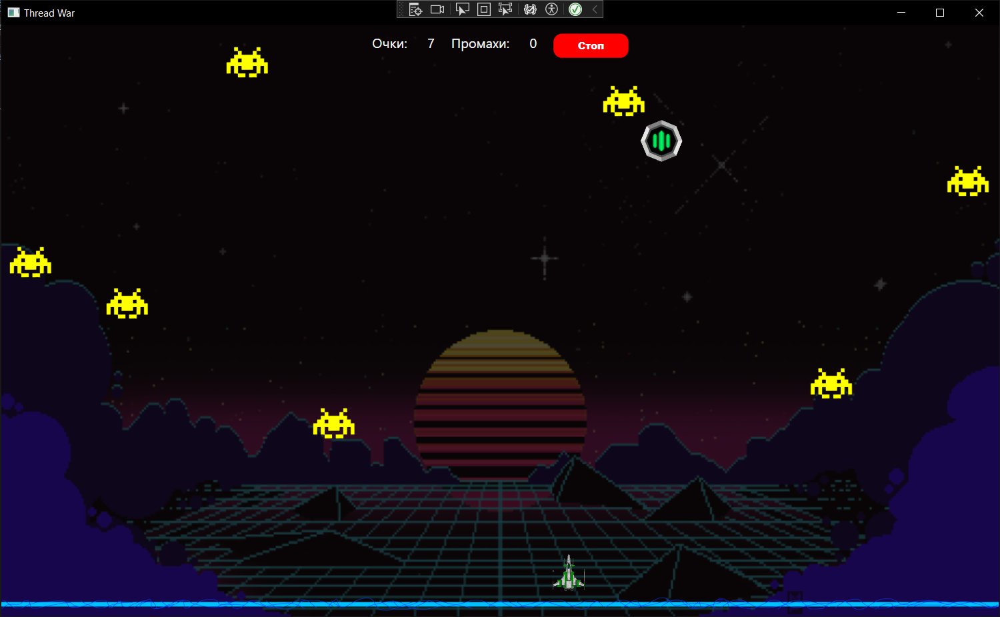

# WarThreads



## Обзор

**WarThreads** — это увлекательная многопоточная игра, разработанная на языке C# с использованием WPF. Игрок управляет пушкой в нижней части экрана, стреляя по врагам, которые летают по всему экрану. Ваша цель — набрать как можно больше очков, уничтожая врагов и избегая промахов.

## Правила игры

1. Управляйте пушкой с помощью клавиш "влево" и "вправо".
2. Стреляйте по врагам, нажимая "пробел".
3. Враги появляются каждую секунду, и их скорость увеличивается со временем.
4. За каждого уничтоженного врага начисляется одно очко.
5. Если пропущено 30 врагов, игра заканчивается.

## Особенности

- **Многопоточность**: Игра использует возможности многопоточности .NET для одновременного выполнения различных задач.
- **Синхронизация**: Реализована синхронизация потоков с помощью стандартных средств .NET.
- **Платформенно-зависимые вызовы**: Используются вызовы PInvoke для обработки ввода с консоли.
- **Графика WPF**: Яркая и красочная графика, созданная с помощью WPF.

## Использованный стэк технологий

- **Язык программирования**: C#
- **Графический интерфейс**: Windows Presentation Foundation (WPF)
- **Многопоточность**: .NET Threads
- **Синхронизация**: Mutex, Semaphore, Event
- **Платформенно-зависимые вызовы**: PInvoke

## Запуск приложения

1. Склонируйте репозиторий:
   ```bash
   git clone https://github.com/1SERGIO11/WarThreads.git
2. Откройте проект в Visual Studio.
3. Постройте решение и запустите приложение.

Наслаждайтесь игрой!
